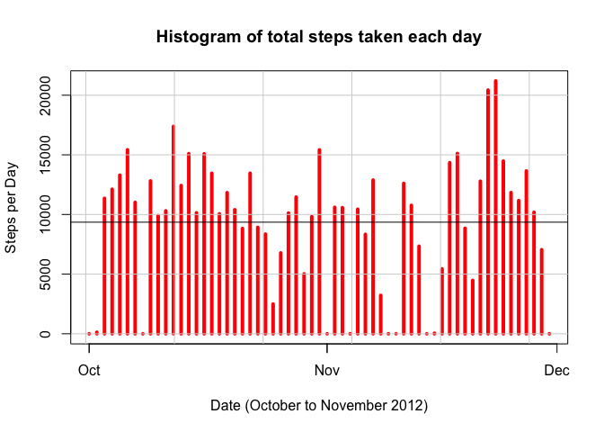
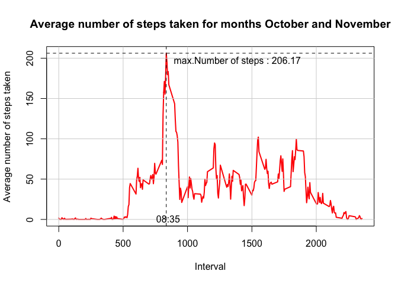
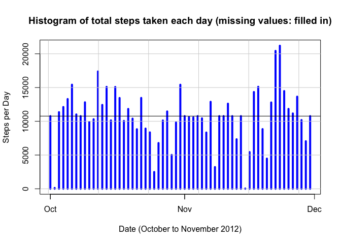
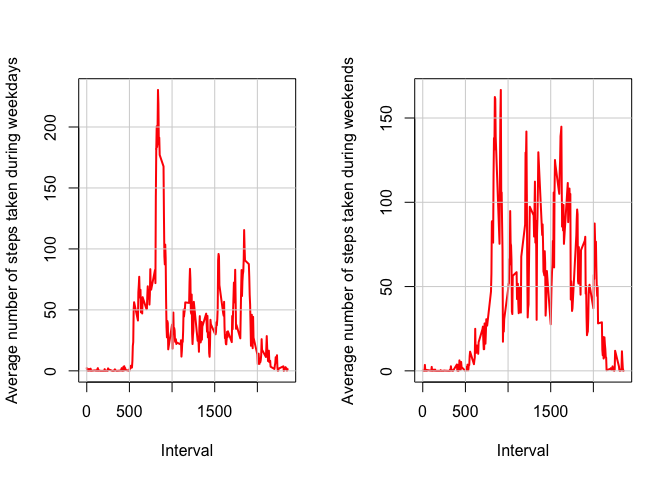

# Course Project 1  
### Constantinos Lirigos  

---------------------------------------------

This assignment makes use of data from a personal activity monitoring device. This device collects data at 5 minute intervals through out the day. The data consists of two months of data from an anonymous individual collected during the months of October and November, 2012 and include the number of steps taken in 5 minute intervals each day.  

Dataset: "Activity monitoring data" [52K]  
It has been saved in the R Working Directory as **activity.csv**

The variables included in this dataset are:

- steps: Number of steps taking in a 5-minute interval (missing values are coded as NA)  
- date: The date on which the measurement was taken in YYYY-MM-DD format
- interval: Identifier for the 5-minute interval in which measurement was taken  

The dataset is stored in a comma-separated-value (CSV) file and there are a total of 17,568 observations in this dataset. 

The following steps/answers must be completed:  
**1. Load and preprocess the data**  


```r
## store the dataset to "a"
a <- read.csv("activity.csv", header = TRUE, colClasses = c("integer", "character", "integer" ))
## convert the a$date variable from type "character" to type "date"
a$date <- strptime(a$date, "%Y-%m-%d")
## make the following data set:
## "b" : a wide data set from "a", which has 288 obs and 62 collumns: the 1st (id collumn) the "interval" values and another 61 collumns (one for each day) the "steps" values
library(reshape2)
b <- dcast(a, interval ~ date, value.var = "steps")
```

**2. What is mean total number of steps taken per day?**  
(For this part of the assignment, missing values can be ignored)  

2.1 Calculate the total number of steps taken per day.

```r
## use the "b" dataset and calculate a vector "totalsteps" with the sums of all collumns (collumns 2:62)
steps <- colSums(b[,2:62], na.rm = TRUE)
dates <- unique(a$date)
totalsteps <- data.frame(dates)
totalsteps$totalsteps <- steps
totalsteps
```

```
##         dates totalsteps
## 1  2012-10-01          0
## 2  2012-10-02        126
## 3  2012-10-03      11352
## 4  2012-10-04      12116
## 5  2012-10-05      13294
## 6  2012-10-06      15420
## 7  2012-10-07      11015
## 8  2012-10-08          0
## 9  2012-10-09      12811
## 10 2012-10-10       9900
## 11 2012-10-11      10304
## 12 2012-10-12      17382
## 13 2012-10-13      12426
## 14 2012-10-14      15098
## 15 2012-10-15      10139
## 16 2012-10-16      15084
## 17 2012-10-17      13452
## 18 2012-10-18      10056
## 19 2012-10-19      11829
## 20 2012-10-20      10395
## 21 2012-10-21       8821
## 22 2012-10-22      13460
## 23 2012-10-23       8918
## 24 2012-10-24       8355
## 25 2012-10-25       2492
## 26 2012-10-26       6778
## 27 2012-10-27      10119
## 28 2012-10-28      11458
## 29 2012-10-29       5018
## 30 2012-10-30       9819
## 31 2012-10-31      15414
## 32 2012-11-01          0
## 33 2012-11-02      10600
## 34 2012-11-03      10571
## 35 2012-11-04          0
## 36 2012-11-05      10439
## 37 2012-11-06       8334
## 38 2012-11-07      12883
## 39 2012-11-08       3219
## 40 2012-11-09          0
## 41 2012-11-10          0
## 42 2012-11-11      12608
## 43 2012-11-12      10765
## 44 2012-11-13       7336
## 45 2012-11-14          0
## 46 2012-11-15         41
## 47 2012-11-16       5441
## 48 2012-11-17      14339
## 49 2012-11-18      15110
## 50 2012-11-19       8841
## 51 2012-11-20       4472
## 52 2012-11-21      12787
## 53 2012-11-22      20427
## 54 2012-11-23      21194
## 55 2012-11-24      14478
## 56 2012-11-25      11834
## 57 2012-11-26      11162
## 58 2012-11-27      13646
## 59 2012-11-28      10183
## 60 2012-11-29       7047
## 61 2012-11-30          0
```
2.2 Make a histogram of the total number of steps taken each day.

```r
plot(dates, steps, main="Histogram of total steps taken each day", xlab="Date (October to November 2012)", ylab="Steps per Day", type="h", lwd=4, col="red")
grid(lty = 1)
abline(h = mean(totalsteps$totalsteps))
```

<!-- -->


2.3 Calculate and report the mean and median of the total number of steps taken per day.

```r
totalsteps_mean <- mean(totalsteps$totalsteps)
totalsteps_median <- median(totalsteps$totalsteps)
paste("Mean of the total number of steps per day :", totalsteps_mean)
```

```
## [1] "Mean of the total number of steps per day : 9354.22950819672"
```

```r
paste("Median of the total number of steps per day :",totalsteps_median)
```

```
## [1] "Median of the total number of steps per day : 10395"
```

**3. What is the average daily activity pattern?**  

3.1 Make a time series plot of the 5-minute interval (x-axis) and the average number of steps taken, averaged across all days (y-axis).   

We will use the "b" dataframe: It has 288 rows (one for each 5 minute interval) and 62 collumns: the 1st (id collumn) the "interval" values and another 61 collumns (one for each day).


```r
b$intervalsteps <- rowMeans(b[,-1], na.rm = TRUE)
plot(b$interval, b$intervalsteps, type = "l", xlab = "Interval", ylab = "Average number of steps taken", main = "Average number of steps taken for months October and November", col = "red", lwd = 2)
grid(lty=1)
maxsteps <- max(b$intervalsteps)
maxstepsinterval <- b$interval[which(b$intervalsteps %in% maxsteps)]
abline(v= maxstepsinterval, lty = 2)
abline(h= maxsteps, lty = 2)
mm1 <- maxstepsinterval+15
mm2 <- maxsteps-10
text(mm1, mm2, paste("max.Number of steps :",round(maxsteps, 2)), pos = 4)
text(mm1, 1, paste("0", substr(maxstepsinterval, 1, 1), ":", substr(maxstepsinterval, 2, 3), sep = ""))
```

<!-- -->

3.2 Which 5-minute interval, on average across all the days in the dataset, contains the maximum number of steps?  


```r
maxsteps <- max(b$intervalsteps)
maxstepsinterval <- b$interval[which(b$intervalsteps %in% maxsteps)]
paste("5-minute interval with max. number of steps = ", "0", substr(maxstepsinterval, 1, 1), ":", substr(maxstepsinterval, 2, 3), sep = "")
```

```
## [1] "5-minute interval with max. number of steps = 08:35"
```


**4. Imputing missing values**  

Note that there are a number of days/intervals where there are missing values (coded as NAs). The presence of missing days may introduce bias into some calculations or summaries of the data.  

4.1 Calculate and report the total number of missing values in the dataset (i.e. the total number of rows with NAs)

```r
totalNA <- sum(is.na(a$steps))
paste("Total Number of rows with Nas :", totalNA)
```

```
## [1] "Total Number of rows with Nas : 2304"
```

4.2 Devise a strategy for filling in all of the missing values in the dataset. The strategy does not need to be sophisticated. For example, you could use the mean/median for that day, or the mean for that 5-minute interval, etc.  

Collumn 63 of the "b" dataframe, has the average number of steps taken for each 5-minute interval, averaged across all days. We will check for each day, each interval and if it is NA, we will replace it with corresponding agerage value for this specific interval (from collumn 63: b$intervalsteps = b[,63])

4.3 Create a new dataset that is equal to the original dataset but with the missing data filled in.  


```r
ib <- b
for (i in 2:62){
        ib[is.na(ib[,i]),i] <- ib[is.na(ib[,i]),63]
}
```

4.4 Make a histogram of the total number of steps taken each day and Calculate and report the mean and median total number of steps taken per day.  


```r
dates <- unique(a$date)
isteps <- colSums(ib[,2:62], na.rm = TRUE)
totalisteps <- data.frame(dates)
totalisteps$totalisteps <- isteps

plot(dates, isteps, main="Histogram of total steps taken each day (missing values: filled in)", xlab="Date (October to November 2012)", ylab="Steps per Day", type="h", lwd=4, col="blue")
grid(lty = 1)
abline(h = mean(totalisteps$totalisteps))
```

<!-- -->


```r
totalisteps_mean <- mean(totalisteps$totalisteps)
totalisteps_median <- median(totalisteps$totalisteps)
paste("Mean of the total number of steps per day :", totalisteps_mean)
```

```
## [1] "Mean of the total number of steps per day : 10766.1886792453"
```

```r
paste("Median of the total number of steps per day :",totalisteps_median)
```

```
## [1] "Median of the total number of steps per day : 10766.1886792453"
```

4.5 Do these values differ from the estimates from the first part of the assignment? What is the impact of imputing missing data on the estimates of the total daily number of steps?  

These values differ from those of the first part of the assignment.
There has been an increase of the number of total steps.
The mean has increased from 

```r
totalsteps_mean
```

```
## [1] 9354.23
```
to

```r
totalisteps_mean
```

```
## [1] 10766.19
```
which is an increase of

```r
paste(round(100*(totalisteps_mean/totalsteps_mean-1),2),"%")
```

```
## [1] "15.09 %"
```

and the median has increased from

```r
totalsteps_median
```

```
## [1] 10395
```
to

```r
totalisteps_median
```

```
## [1] 10766.19
```
which is an increase of

```r
paste(round(100*(totalisteps_median/totalsteps_median-1),2),"%")
```

```
## [1] "3.57 %"
```


**5. Are there differences in activity patterns between weekdays and weekends?**  

(the dataset with the filled-in missing values will be used).

5.1 Create a new factor variable in the dataset with two levels "weekday" and "weekend" indicating whether a given date is a weekday or weekend day.  


```r
for (i in 1:length(a$date)) {
        if (weekdays(a$date[i]) == "Saturday" | weekdays(a$date[i]) == "Sunday") {
                a$wday[i] <- "Weekend"
        }
        else {
                a$wday[i] <- "Weekday" 
        }        
}
a$wday <- as.factor(a$wday)
## create again a "wide" dataframe from the new "a"
ib2 <- dcast(a, interval ~ date + wday, value.var = "steps")
## the new dataframe "ib2" has embeded in the collumn name the factor "Weekend/Weekday"
## create a new collumn (Nr.63) with the means for each interval
ib2$intervalsteps <- rowMeans(ib2[,-1], na.rm = TRUE)
## impute again
for (i in 2:62){
        ib2[is.na(ib2[,i]),i] <- ib2[is.na(ib2[,i]),63]
}
## create 2new collumns : Nr. 64 with the rowmeans for Weekdays and Nr. 65 with the rowmeans for Weekends
library(dplyr)
```

```
## 
## Attaching package: 'dplyr'
```

```
## The following objects are masked from 'package:stats':
## 
##     filter, lag
```

```
## The following objects are masked from 'package:base':
## 
##     intersect, setdiff, setequal, union
```

```r
ib2$weekdaysteps <- rowMeans(select(ib2, contains("Weekday")))
ib2$weekendsteps <- rowMeans(select(ib2, contains("Weekend")))
```

the new dataframe "ib2" has :  
- 288 rows (1 for each interval) and  
- 65 collumns:   
* Nr.1 1 for the id of the 5-minute interval,   
* Nr. 2 to Nr. 62: 61 collumns, one for each day (collumn's name includes wether it is weekend or weekday)  
* Nr. 63 ("intervalsteps") mean values across all days  
* Nr. 64 ("weekdaysteps") mean values across weekdays  
* Nr. 65 ("weekendsteps") mean values across weekends  

```

5.2 Make a panel plot containing a time series plot of the 5-minute interval (x-axis) and the average number of steps taken, averaged across all weekday days or weekend days (y-axis). 


```r
par(mfcol=c(1,2))
main = "Average number of steps taken for months October and November"
plot(ib2$interval, ib2$weekdaysteps, type = "l", xlab = "Interval", ylab = "Average number of steps taken during weekdays",  col = "red", lwd = 2)
grid(lty=1)
plot(ib2$interval, ib2$weekendsteps, type = "l", xlab = "Interval", ylab = "Average number of steps taken during weekends",  col = "red", lwd = 2)
grid(lty=1)
```

<!-- -->


